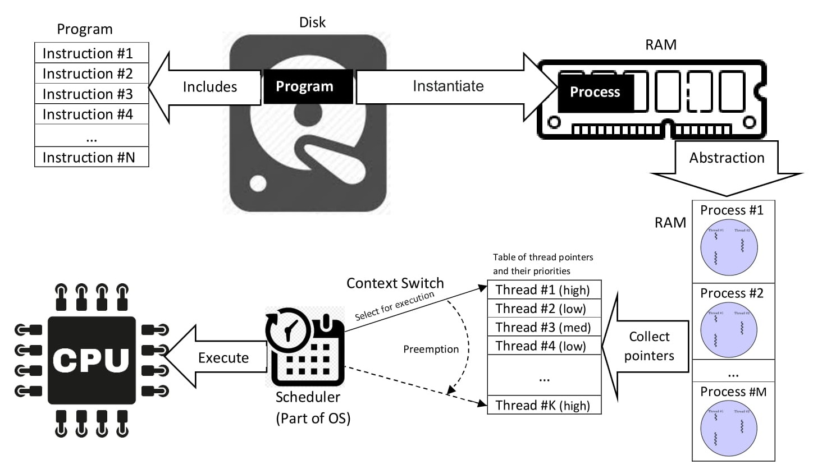
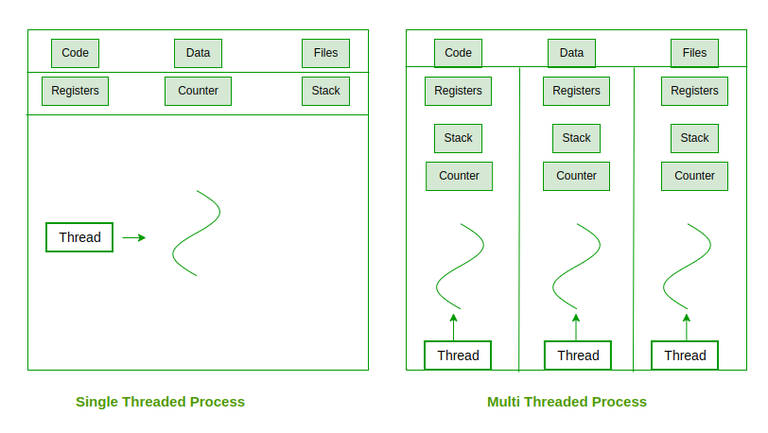
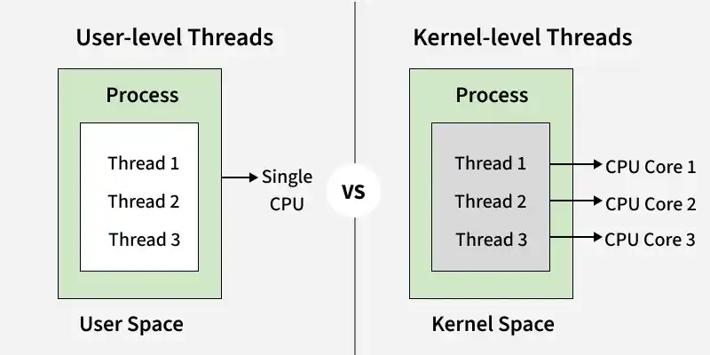

# 1. Thread
<!-- 
```text
        THREAD
           │
           ▼
   ┌───────────────┐
   │ Race Condition│ ⭐⭐⭐
   └───────┬───────┘
           ▼
      ┌────────┐
      │ Mutex  │ ⭐⭐⭐
      └────┬───┘
           ▼
   ┌────────────────┐
   │ Condition Var  │ ⭐⭐⭐
   └───────┬────────┘
           ▼
   Producer-Consumer ⭐⭐⭐
           │
           ▼
      ┌──────────┐
      │ Deadlock │ ⭐⭐⭐
      └──────────┘
``` -->



> 'A thread is a single sequence stream within a process and is called a lightweight process because it is smaller and faster. It allows multiple tasks to run simultaneously, improving program efficiency.'



## Why we need thread?

When we create a new **process**:

```text
Process A
┌──────────────────────────────┐
│ Address Space                │
│                              │
│ Code                         │
│ Data                         │
│ Heap                         │
│ Stack                        │
│                              │
│ File descriptors             │
└──────────────────────────────┘
             │
           fork()
             │
             ▼
Process B
┌──────────────────────────────┐
│ Address Space                │
│ Code                         │
│ Data                         │
│ Heap                         │
│ Stack                        │
│                              │
│ File descriptors             │
└──────────────────────────────┘
```

Each process have specific address space.  
If you want to communication A and B, you need IPC:

- pipe
- share memory
- socket
- message queue
- . . .

**Thread** is different.  
Thread inside process

```text
                 Process
┌─────────────────────────────────────┐
│                                     │
│   Shared Address Space              │
│                                     │
│   Code                              │
│   Global data                       │
│   Heap                              │
│                                     │
│      ┌─────────────┐                │
│      │ Main Thread │                │
│      │ Stack       │                │
│      └─────────────┘                │
│                                     │
│      ┌─────────────┐                │
│      │ Worker      │                │
│      │ Thread      │                │
│      │ Stack       │                │
│      └─────────────┘                │
│                                     │
└─────────────────────────────────────┘
```

Threads share:

```text
Code
Global variables
Heap
Open file descriptors
...
```

but each thread has:

```c
Register state
Stack
Thread ID
Scheduling state
```

**Thread** are needed in modern operating systems and applications because they:

- **Improve Performance**: Threads allow multiple tasks to run at the same time (parallel or interleaved), making programs execute faster.
- **Increase Responsiveness**: If one thread is busy, another can handle user actions, keeping the application responsive.
- **Enable Concurrency**: Multiple operations like saving files, processing data, and handling user input can happen simultaneously.
- **Better CPU Utilization**: On multi-core systems, threads can run on different cores, improving overall system performance.
- **Efficient Resource Sharing**: Threads share the same memory and resources within a process, making communication faster and reducing overhead.

## Compare Thread and Proces

**Process**

|Strength|Weakness|
|:-----|:-----|
|Good isolation|Creation/management is usually more resource-intensive.|
|Good fail isolaton|Complex IPC|
|Good security boundary|Data sharing is more difficult.|
|Specific address space||

**Thread**

|Strength|Weakness|
|:-----|:-----|
|Consumes less memory than the process|Shared memory → race condition|
|Easily share memories|Need synchronization|
|Inter-thread communication is very fast|A memory error can affect the entire process.|
|Suitable for parallel/concurrent work within the same application|A deadlock can occur.|

## Components of Threads

These are the basic components of the Operating System.

- **Stack Space**: Stores local variables, function calls, and return addresses specific to the thread.
- **Register Set**: Hold temporary data and intermediate results for the thread's execution.
- **Program Counter**: Tracks the current instruction being executed by the thread.

## Types of Threads

Threads are mainly classified based on how they are managed and scheduled in an operating system. There are two primary types of threads.

- User Level Thread
- Kernel Level Thread



## Library

POSIX threads library (libpthread, -lpthread)

```c
#include <ptheread.h>
```

## Create thread

Prototype

```c
extern int pthread_create (pthread_t *__restrict __newthread,
      const pthread_attr_t *__restrict __attr,
      void *(*__start_routine) (void *),
      void *__restrict __arg) __THROWNL __nonnull ((1, 3));
```

Return:

- 0 :           if success
- error number: if error

Example

```c
void *worker(void *arg)
{
    int *p = arg;

    (*p)++;

    printf("Hello from thread %d\n", *p);
    return NULL;
}

int main(void)
{
    int x = 100;

    pthread_t tid;

    pthread_create(&tid,   /*  consit thread id */
                   NULL,   /* config of thread */
                   worker, /* function pointer */
                   &x);    /* argument pass into function pointer */

    pthread_join(tid, NULL);
    return 0;
}
```

After create thread we have:

```text
                Process
                   │
        ┌──────────┴──────────┐
        │                     │
   Main Thread            Worker Thread
        │                     │
     main()                worker()
        │                     │
        │                  arg = &x
        │                     │
        └──────────┬──────────┘
                   │
              shared memory
```

**Thread** has a weakness:  
If thread 1 and thread 2 access simultaneously into an address, it is a **race condition**.  
Therefore, it needs:

```text
mutex
condition variable
semaphore
```

## Thread ID

> Thread ID is used to distinguish between threads.

- **Manage threads**: When you want to control a specific thread (for example: to pause or cancel it, or to wait for it to finish using `thread_joint(id, NULL)`), you must specify it's ID.
- **Monitoring and Debuging**: when printing messages to the screen (logging), including thread ID helps you identify exactly which thread is executing.

Prototype:

```c
extern pthread_t pthread_self (void);
````

An examle of printing the thread ID:

```c
void* print_id(void* arg) {
    pthread_t my_id = pthread_self();
    
    printf("Thread id: %lu\n", (unsigned long)my_id);
    
    return NULL;
}

int main() {
    pthread_t thread1, thread2;

    pthread_create(&thread1, NULL, print_id, NULL);
    pthread_create(&thread2, NULL, print_id, NULL);

    pthread_join(thread1, NULL);
    pthread_join(thread2, NULL);

    return 0;
}
```

```text
Thread id: 131767210079808
Thread id: 131767201687104
```

### pthread_equal(id1, id2)

When you want to check whether two threads have the same id, you can use `pthread_equal`.

Prototype:

```c
int pthread_equal(pthread_t tid1, pthread_t tid2);
```

Return value:

- nonzero : if equal
- 0       : otherwise

## pthread_join()

> The current thread waits for a specific thread to finish.

Prototype:

```c
int pthread_join(
    pthread_t thread,   /* thread id want to wait */
    void **return_value /* the value of thread return */
);
```

Return value:

> On success, `pthread_join()` returns 0;  
> On error, it returns an error number.

Example:

```c
void *worker(void *arg)
{
    printf("Worker: start\n");

    int *rel = malloc(sizeof(int));

    *rel = 123;

    sleep(2);

    printf("Worker: end\n");

    return rel;
}

int main(void)
{
    pthread_t tid;

    void *ret = NULL;

    pthread_create(&tid, NULL, worker, NULL);

    printf("Main: waiting...\n");

    pthread_join(tid, &ret);

    printf("Main: worker finished\n");

    printf("%d\n", *(int *)ret);
    free(ret);

    return 0;
}
```

```text
Main: waiting...
Worker: start
Worker: end
Main: worker finished
123                      <-------- the return value of thread
```

Timeline:

```text
                         PROCESS
┌──────────────────────────────────────────────────────────────┐
│                                                              │
│ MAIN THREAD                         WORKER THREAD            │
│                                                              │
│ pthread_create() ──────────────────────► worker()            │
│      │                                    │                  │
│      │                                    ├─ printf start    │
│      │                                    │                  │
│      │                                    ├─ malloc()        │
│      │                                    │       │          │
│      │                                    │       ▼          │
│      │                                    │    HEAP          │
│      │                                    │   [   ?   ]      │
│      │                                     │       │         │
│      │                                    ├─ *rel = 123      │
│      │                                    │       │          │
│      │                                    │       ▼          │
│      │                                    │    [ 123 ]       │
│      ▼                                    │                  |
│ printf waiting                           ├─ sleep(2)         │
│      │                                   │                   │
│      ▼                                   │                   │
│ pthread_join()                           │                   │
│      │                                   │                   │
│      │ WAIT                              │                   │
│      │                                   ├─ printf end       │
│      │                                   │                   │
│      │                                   ├─ return rel       │
│      │                                   │       │           │
│      │                                   │       ▼           │
│      │                                   │   return 0x5000   │
│      │                                   │                   │
│      ◄───────────────────────────────────┘                   │
│      │                                                       │
│      ▼                                                       │
│ ret = 0x5000                                                 │
│      │                                                       │
│      ▼                                                       │
│ *(int *)ret → 123                                            │
│      │                                                       │
│      ▼                                                       │
│ free(ret)                                                    │
│      │                                                       │
│      ▼                                                       │
│  HEAP MEMORY RELEASED                                        │
│                                                              │
└──────────────────────────────────────────────────────────────┘
```

Without `pthread_join()`, the `main` function might terminate before the thread completes its work.

## Terminate Thread

A thread can terminate by:

- canceled by another thread in the same process
- calls `pthread_exit(NULL)`
- returns from `routine()`

### pthread_exit()

Prototype:

```c
void pthread_exit (void *__retval);
```

## pthread_detach()

There are two way to manage thread:

- **Joinable**: nead call `pthread_join()` to reclaim resource.  
- **Detached**: auto reclaim resource after thread finished. It is not possible to `pthread_join()` it after that.

Prototype:

```c
int pthread_detach (pthread_t __th);
```

Example:

```c
void *delay_1(void *arg)
{
    printf("Thread is delaying 5s ...\n");
    sleep(5);
    printf("Thread stopped!\n");
    return NULL;
}

int main(void)
{
    int ret;

    pthread_t tid1;

    pthread_create(&tid1,    /*  consit thread id */
                   NULL,     /* config of thread */
                   delay_1,  /* function pointer */
                   NULL);    /* argument pass into function pointer */
    pthread_detach(tid1);

    printf("Main is still running ...\n");

    ret = pthread_join(tid1, NULL);
    
    sleep(1);
    printf("%d\n", ret);
    printf("Main stopped!\n");

    return 0;
}
```

```text
Main is still running ...
Thread is delaying 5s ...
22                          <---- error number when using pthread_join()
Main stopped!
```

It appears that the main function continues executing while the thread is running; I called `pthread_join()`, but it didn't work and return an error number `22`, causing the main function to terminate before the thread finished its task.

**Tip**

> A detached thread is suitable for a worker when you do not need to retrieve a result or wait for it to complete.

##

## Threading Issues

- **fork() and exec()**: In multithreaded programs, fork() may duplicate all threads or just the calling thread, depending on the system. exec() replaces the entire process including all threads with the new program.
- **Signal Handling**: Signals notify a process of events. They can be synchronous or asynchronous and are handled by either the default kernel handler or a user-defined handler.
- **Thread Cancellation**: Threads can be terminated before completion. Cancellation can be asynchronous (immediate) or deferred (thread checks periodically). Example: stopping all threads loading a webpage.
- **Thread-Local Storage (TLS)**: Threads share process data, but sometimes need private copies, such as unique identifiers for transactions.
- **Scheduler Activations**: The kernel provides virtual processors, allowing a user-thread library to schedule threads efficiently.

# 2. Thread Memory Model & Shared Data

The overall picture

```text
                    PROCESS
        ┌──────────────────────────────┐
        │                              │
        │   CODE       ←── shared      │
        │   GLOBAL     ←── shared      │
        │   HEAP       ←── shared      │
        │                              │
        │ ┌────────┐ ┌────────┐ ┌─────┐│
        │ │Thread 1│ │Thread 2│ │ T3  ││
        │ │ Stack  │ │ Stack  │ │Stack││
        │ └────────┘ └────────┘ └─────┘│
        │                              │
        └──────────────────────────────┘
```

# 3. Race Condition

## What is Concurrency?

> Concurrency mean that two threads run simultaneously.  

In reality, only one thread is executed by the CPU at a time, but the CPU can rapidly switch between threads to create the effect of them executing in parallel.

## Race Condition

> A race condition is an error where the program's outcome depends on the uncontrolled order or interleaving of threads.

### Critical Section

> Critial section is a segment of code that accesses a shared resource that we want to control concurrent execution by multiple threads.

Example i have 1000 threads add 1 to x 1000 times:

```c
#include <stdio.h>
#include <pthread.h>

void *rountine(void *arg)
{
    int *p = arg;
    /* add 1 to x and loop it 1000 times*/
    for (int i = 0; i < 1000; i++)
    {
        *p += 1;
    }

    return NULL;
}

int main(int argc, char *argv[])
{
    int x = 0;
    /* i will create 1000 thread */
    int numthread = 1000;
    pthread_t thread_id[numthread];

    /* create thread */
    for (int i = 0; i < numthread; i++)
    {
        if (pthread_create(&thread_id[i], NULL, rountine, &x) != 0)
        {
            printf("Create thread %d fail.\n", i + 1);
            return (i + 1);
        }
    }

    /* join thread */
    for (int i = 0; i < numthread; i++)
    {
        if (pthread_join(thread_id[i], NULL) != 0)
        {
            printf("join thread %d fail.\n", i + 1);
            return (i + 101);
        }
    }

    /* ptint out the value of x after 1000 thread run */
    printf("x = %d\n", x);

    return 0;
}
```

```text
x = 994728
```

As we expected, x must be 1000000, but actually, x is 994728. It is **race condition**.  
How to detect race condition?

```text
① Are there multiple threads? 
↓
② What data do they share? 
↓
③ Who reads? 
↓
④ Who writes? 
↓
⑤ Can accesses occur concurrently? 
↓
⑥ Is there synchronization? 
↓
⑦ Does the result depend on the execution order?
```

We can fix it by using a variable `lock` following example below:

```c
void *rountine(void *arg)
{
    int *p = arg;
    /* add 1 to x and loop it 1000 times*/
    for (int i = 0; i < 1000; i++)
    {
        while(lock == 1)
        {
            /* wait until lock = 0 */
        }
        lock = 1;
        *p += 1;
        lock = 0;
    }

    return NULL;
}
```

Using a variable `lock` to lock a segment code is a good idea, but the way I carried it out was terrible.  
In fact, we have a interface in `phtread` library that allows us to do that. `pthread_mutex`

# 4. Thread Synchronization

## pthread_mutex

> Mutex = Mutual Exclusion

A mutex is basically a lock that we set (lock) before accessing a shared resource and release (unlock) when we’re done.

Declare:

```c
pthread_mutex_t mutex = PTHREAD_MUTEX_INITIALIZER;
```

Basic structual:

```c
pthread_mutex_lock(&mutex);
/*
 * critical section
 */
pthread_mutex_unlock(&mutex);
```

Example:

```c
#include <stdio.h>
#include <pthread.h>

pthread_mutex_t mutex = PTHREAD_MUTEX_INITIALIZER;

void *rountine(void *arg)
{
    int *p = arg;
    /* add 1 to x and loop it 1000 times*/
    for (int i = 0; i < 1000; i++)
    {
        pthread_mutex_lock(&mutex);
        *p += 1;
        pthread_mutex_unlock(&mutex);
    }

    return NULL;
}

int main(int argc, char *argv[])
{
    int x = 0;
    /* i will create 1000 thread */
    int numthread = 1000;
    pthread_t thread_id[numthread];


    /* create thread */
    for (int i = 0; i < numthread; i++)
    {
        if (pthread_create(&thread_id[i], NULL, rountine, &x) != 0)
        {
            printf("Create thread %d fail.\n", i + 1);
            return (i + 1);
        }
    }

    /* join thread */
    for (int i = 0; i < numthread; i++)
    {
        if (pthread_join(thread_id[i], NULL) != 0)
        {
            printf("join thread %d fail.\n", i + 1);
            return (i + 101);
        }
    }

    /* ptint out the value of x after 1000 thread run */
    printf("x = %d\n", x);

    return 0;
}
```

```text
x = 1000000
```

That's right, the results are exactly as we expected.

**A quick note:**  
If thread 1 uses `pthread_mutex_lock` but thread 2 doesn't use it, thread 2 can still access the variable being protected by thread 1.  
  
Example:

```c
#include <stdio.h>
#include <pthread.h>

pthread_mutex_t mutex = PTHREAD_MUTEX_INITIALIZER;

void *rountine(void *arg)
{
    int *p = arg;
    /* add 1 to x and loop it 1000 times*/
    for (int i = 0; i < 1000; i++)
    {
        pthread_mutex_lock(&mutex);
        *p += 1;
        pthread_mutex_unlock(&mutex);
    }

    return NULL;
}

void *rountine1(void *arg)
{
    int *p = arg;
    /* add 1 to x and loop it 1000 times*/
    for (int i = 0; i < 1000; i++)
    {
        *p += 1;
    }

    return NULL;
}

int main(int argc, char *argv[])
{
    int x = 0;
    /* i will create 1000 thread */
    int numthread = 1000;
    pthread_t thread_id[numthread];
    pthread_t id;


    /* create thread use mutex lock */
    for (int i = 0; i < numthread; i++)
    {
        if (pthread_create(&thread_id[i], NULL, rountine, &x) != 0)
        {
            printf("Create thread %d fail.\n", i + 1);
            return (i + 1);
        }
    }

    /* create thread that doesn't use mutex lock */
    pthread_create(&id, NULL, rountine1, &x);

    /* join thread */
    for (int i = 0; i < numthread; i++)
    {
        if (pthread_join(thread_id[i], NULL) != 0)
        {
            printf("join thread %d fail.\n", i + 1);
            return (i + 101);
        }
    }

    /* join thread */
    pthread_join(id, NULL);

    /* ptint out the value of x after 1000 thread run */
    printf("x = %d\n", x);

    return 0;
}
```

```text
x = 1000954
```

The result I expected is 1001000 but as we can see, it is 1000954. Why is that? Because there is a thread that does not use the mutex, so it can access the variable x while it is being protected. It is race condition.

### trylock

Example:

```c
#include <stdio.h>
#include <pthread.h>
#include <unistd.h>

pthread_mutex_t mutex = PTHREAD_MUTEX_INITIALIZER;

void *routine1(void *arg)
{
    printf("Thread 1 will lock and sleep 5 seconds.\n");
    pthread_mutex_lock(&mutex);
    sleep(5);
    pthread_mutex_unlock(&mutex);
    printf("Thread 1 unlock.\n");
    return NULL;
}

void *routine2(void *arg)
{
    sleep(1);
    printf("Thread 2 try to lock during the thread 1 lock.\n");
    if(pthread_mutex_trylock(&mutex) == 0)
    {

    }
    else
    {
        printf("Thread 2 try to lock fail.\n");
    }

    return NULL;
}

int main(int argc, char *argv[])
{
    pthread_t thid1, thid2;

    pthread_create(&thid1, NULL, routine1, NULL);
    pthread_create(&thid2, NULL, routine2, NULL);

    pthread_join(thid1, NULL);
    pthread_join(thid2, NULL);

    return 0;
}
```

## Atomic instructions

**Define:**

> An operation is observed as a unit that can not be interleaved by another thread.

### Compare-and-Swap — CAS

Concept:

```text
CAS(address, expected, new_value)
```

## spin lock

Concept:

```c
while (CAS(&lock, 0, 1) != SUCCESS)
{
    // wait
}
```

```text
              lock = 0
                  │
          ┌───────┴───────┐
          ▼               ▼
         T1               T2
          │               │
       CAS 0→1         CAS 0→1
          │               │
       SUCCESS           FAIL
          │               │
          ▼               ▼
       ENTER            WAIT
       critical            │
       section             │
          │                │
       unlock              │
          │                │
          └────────────► retry
```

**Spin lock has a problem**:  
If thread 1 is occupying the critical section, thread 2 will continously attempt to access it until successful. Therefore, thread 2 consumes CPU to wait. This is **Busy Waiting/ Spinning**.

## Blocking Lock

Thread 2 will no longer attempt to access the critical section; instead, it will enter a sleep state and be awakened by the system when Thread 1 unlocks it.

```text
T1 lock()

T2
 │
 └── lock()
       │
       ▼
    unavailable
       │
       ▼
      SLEEP
       │
       │
    mutex available
       │
       ▼
     WAKE
       │
       ▼
    acquire
```

**Compare between Spin lock and Blocking lock**:

| | Spinlock | Blocking lock |
| :----------------- | :------------------- | :-------------------- |
| When lock is busy | CPU keeps running | Thread sleeps |
| CPU usage | High | Low |
| Context switch | Not immediately required | May occur |
| Short hold time | Good | Potential overhead |
| Long hold time | Poor | Good |
| Implementation | Atomic instructions | Atomic + wait/wakeup |

## Futex

> futex = fast userspace mutex

Futex is a Linux mechanism provided to support:  

> wait/wake giữa threads dựa trên một giá trị trong userspace.

# 5. Mars Pathfinder & Priority Inversion

## Mars Pathfinder

In 1997, the Mars Pathfinder spacecraft was operating on Mars.

Its onboard system utilized the VxWorks real-time operating system.

A shared resource was protected by a synchronization mechanism.

A low-priority task held the resource.

A high-priority task required that resource.

Subsequently, a medium-priority task began executing.

As a result, the high-priority task was blocked for longer than expected.

The system featured a watchdog timer; when a critical task failed to execute within the expected timeframe, the system would reset.

The situation was identified as priority inversion, and the control team resolved it using a priority inheritance mechanism.

## Priority Inversion

> A mutex solves the race condition problem but introduces a new issue: priority inversion. A higher-priority thread can be blocked by a lower-priority thread.

## Solution: Priority Inheritance
